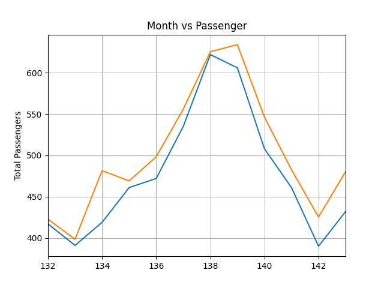

# Time Series Prediction using LSTM with PyTorch in Python

Data 
```
             year month  passengers
        0    1949   Jan         112
        1    1949   Feb         118
        2    1949   Mar         132
        3    1949   Apr         129
        4    1949   May         121
        ..    ...   ...         ...
        139  1960   Aug         606
        140  1960   Sep         508
        141  1960   Oct         461
        142  1960   Nov         390
        143  1960   Dec         432


        (144, 3)

```
<table border="0">
<tr>
    <td>
    
    </td>
</tr>
</table>


# Train
```
python train.py
```

# Test
```
python test.py
```

# predict output

<table border="0">
<tr>
    <td>
    
    </td>
    <td>
    
    </td>
</tr>
</table>